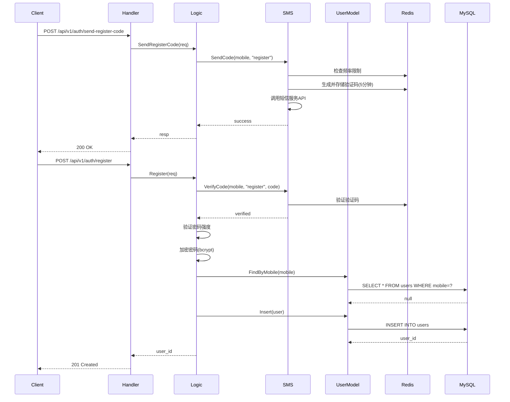
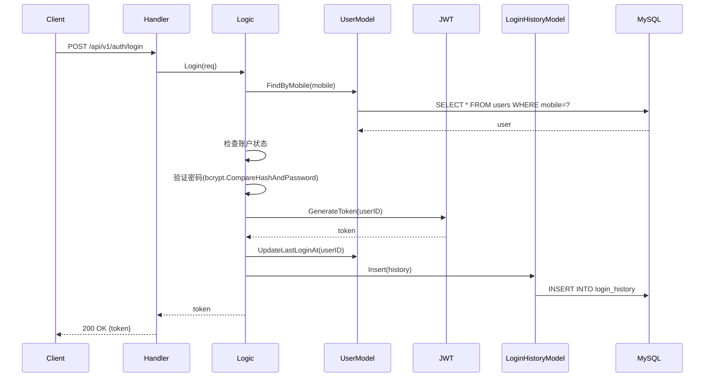
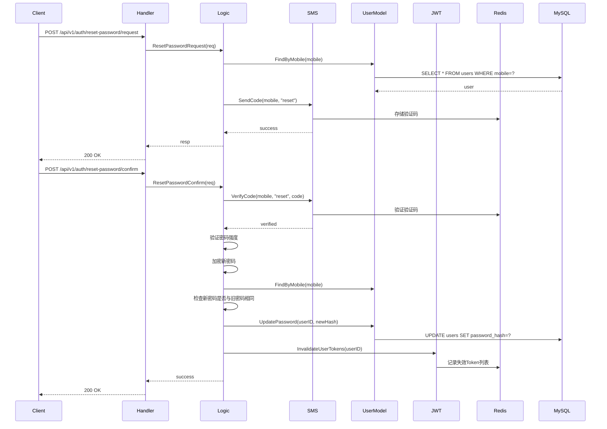

# 用户认证功能技术设计

> **Branch**: `feature/user-auth`  
> **Spec Path**: `specs/user-auth/`  
> **Created**: 2026-01-01  
> **Status**: Draft

---

## Summary

采用 Go-Zero 分层架构实现用户认证功能，使用 GORM 处理复杂查询和事务，Redis 存储验证码，JWT 实现 Token 认证。数据表主键使用 UUID v7 格式，支持分布式环境下的唯一性保证和时间排序。遵循 Handler → Logic → Model 三层架构，确保代码清晰、可测试、易维护。

---

## Technical Context

| Item | Value |
|------|-------|
| **Language** | Go 1.21+ |
| **Framework** | Go-Zero v1.9+ |
| **Storage** | MySQL 8.0 |
| **Cache** | Redis 7.0 |
| **ORM** | GORM (用户表、登录历史表) |
| **验证码存储** | Redis (临时数据，无需ORM) |
| **JWT库** | github.com/golang-jwt/jwt/v5 |
| **密码加密** | golang.org/x/crypto/bcrypt |
| **UUID库** | github.com/google/uuid (v1.6.0+ 支持UUID v7) |
| **Testing** | go test |

---

## Go-Zero 开发流程

按以下顺序完成技术设计和代码生成：

| Step | 任务 | 方式 | 产出 |
|------|------|------|------|
| 1 | 定义 API 文件 | AI 手写 | `api/doc/auth/user_auth.api` |
| 2 | 在入口文件中导入模块 | AI 手写 | `api/doc/api.api` (添加 `import "auth/user_auth.api"`) |
| 3 | 生成 Handler/Types | goctl | `api/internal/handler/auth/`, `api/internal/types/auth/` |
| 4 | 定义 DDL 文件 | AI 手写 | `migrations/auth/users.sql`, `migrations/auth/login_history.sql` |
| 5 | 实现 Model 接口 | AI 手写 | `model/auth/users/`, `model/auth/login_history/` |
| 6 | 实现 Logic 层 | AI 实现 | `api/internal/logic/auth/` |
| 7 | 实现验证码服务 | AI 实现 | `pkg/sms/` (Redis存储) |
| 8 | 实现JWT服务 | AI 实现 | `pkg/jwt/` |
| 9 | 实现UUID工具 | AI 实现 | `pkg/uuid/` (UUID v7生成) |

**goctl 命令**:
```bash
# ⚠️ 重要：必须使用入口文件 api.doc/api.api，不能直接使用模块文件
# 原因：使用模块文件会覆盖 routes.go，导致其他模块路由丢失
goctl api go -api api/doc/api.api -dir api/ --style=go_zero --type-group
```

---

## File Structure

### 文件产出清单

| 序号 | 文件 | 生成方式 | 位置 |
|------|------|----------|------|
| 1 | API 文件 | AI 手写 | `api/doc/auth/user_auth.api` |
| 2 | DDL 文件 | AI 手写 | `migrations/auth/users.sql`, `migrations/auth/login_history.sql` |
| 3 | Handler | goctl 生成 | `api/internal/handler/auth/` |
| 4 | Types | goctl 生成 | `api/internal/types/auth/` |
| 5 | Logic | AI 实现 | `api/internal/logic/auth/` |
| 6 | User Model | AI 手写 | `model/auth/users/` |
| 7 | LoginHistory Model | AI 手写 | `model/auth/login_history/` |
| 8 | SMS服务 | AI 实现 | `pkg/sms/` |
| 9 | JWT服务 | AI 实现 | `pkg/jwt/` |
| 10 | UUID工具 | AI 实现 | `pkg/uuid/` |

### 代码结构

```
api/
├── doc/
│   └── auth/
│       └── user_auth.api                    # API定义文件
├── internal/
│   ├── handler/
│   │   └── auth/
│   │       ├── sendregistercode_handler.go  # goctl 生成
│   │       ├── register_handler.go
│   │       ├── login_handler.go
│   │       ├── sendresetcode_handler.go
│   │       ├── resetpasswordrequest_handler.go
│   │       ├── resetpasswordconfirm_handler.go
│   │       ├── loginhistory_handler.go
│   │       └── routes.go
│   ├── logic/
│   │   └── auth/
│   │       ├── sendregistercode_logic.go    # AI 实现
│   │       ├── register_logic.go
│   │       ├── login_logic.go
│   │       ├── sendresetcode_logic.go
│   │       ├── resetpasswordrequest_logic.go
│   │       ├── resetpasswordconfirm_logic.go
│   │       └── loginhistory_logic.go
│   ├── types/
│   │   └── auth/
│   │       └── types.go                      # goctl 生成
│   └── svc/
│       └── servicecontext.go                 # 手动维护

model/
└── auth/
    ├── users/
    │   ├── interface.go                      # 接口定义
    │   ├── types.go                          # 数据结构
    │   ├── vars.go                           # 常量/错误
    │   ├── factory.go                         # ORM 工厂
    │   └── gorm_dao.go                       # GORM 实现
    └── login_history/
        ├── interface.go
        ├── types.go
        ├── vars.go
        ├── factory.go
        └── gorm_dao.go

pkg/
├── sms/
│   ├── sms.go                                # 短信服务接口
│   ├── redis_store.go                        # Redis验证码存储
│   └── validator.go                          # 验证码验证
├── jwt/
│   ├── jwt.go                                # JWT生成和验证
│   └── claims.go                             # JWT Claims定义
└── uuid/
    └── uuid.go                                # UUID v7生成工具

migrations/
└── auth/
    ├── users.sql
    └── login_history.sql
```

---

## Architecture Overview

遵循 IDRM 分层架构：

```
HTTP Request → Handler → Logic → Model → Database
                      ↓
                   SMS/JWT Service
                      ↓
                    Redis/Config
```

| 层级 | 职责 | 最大行数 |
|------|------|----------|
| Handler | 解析参数、格式化响应 | 30 |
| Logic | 业务逻辑实现 | 50 |
| Model | 数据访问 | 50 |

### 架构决策

1. **ORM选择**: 使用 GORM
   - 用户表需要复杂查询（按手机号查询、状态查询）
   - 登录历史需要分页和关联查询
   - 需要事务支持（注册时创建用户和记录历史）

2. **验证码存储**: 使用 Redis
   - 临时数据，5分钟有效期
   - 高并发读写需求
   - 无需持久化

3. **密码加密**: 使用 bcrypt
   - 行业标准，安全性高
   - Go标准库支持

4. **JWT Token**: 使用 github.com/golang-jwt/jwt/v5
   - 轻量级，无状态
   - 支持自定义Claims

5. **主键策略**: 使用 UUID v7
   - 支持分布式环境下的唯一性保证
   - 基于时间戳，支持按时间排序
   - 避免自增ID的安全隐患（ID可预测）
   - 使用 github.com/google/uuid 库生成（v1.6.0+ 支持UUID v7）

---

## Interface Definitions

### User Model 接口

```go
// model/auth/users/interface.go
type Model interface {
    // Insert 创建用户
    Insert(ctx context.Context, data *User) (*User, error)
    
    // FindOne 根据ID查询用户
    FindOne(ctx context.Context, id string) (*User, error)
    
    // FindByMobile 根据手机号查询用户
    FindByMobile(ctx context.Context, mobile string) (*User, error)
    
    // Update 更新用户信息
    Update(ctx context.Context, data *User) error
    
    // UpdatePassword 更新密码
    UpdatePassword(ctx context.Context, id string, passwordHash string) error
    
    // UpdateStatus 更新账户状态
    UpdateStatus(ctx context.Context, id string, status int) error
    
    // WithTx 支持事务
    WithTx(tx interface{}) Model
    
    // Trans 事务执行
    Trans(ctx context.Context, fn func(ctx context.Context, model Model) error) error
}
```

### LoginHistory Model 接口

```go
// model/auth/login_history/interface.go
type Model interface {
    // Insert 插入登录历史
    Insert(ctx context.Context, data *LoginHistory) (*LoginHistory, error)
    
    // FindOne 根据ID查询
    FindOne(ctx context.Context, id string) (*LoginHistory, error)
    
    // FindByUserID 根据用户ID分页查询
    FindByUserID(ctx context.Context, userID string, page, pageSize int) ([]*LoginHistory, int64, error)
    
    // DeleteOldRecords 删除过期记录（90天前）
    DeleteOldRecords(ctx context.Context, beforeTime time.Time) error
    
    // CountByUserID 统计用户登录历史数量
    CountByUserID(ctx context.Context, userID string) (int64, error)
}
```

### SMS Service 接口

```go
// pkg/sms/sms.go
type Service interface {
    // SendCode 发送验证码
    SendCode(ctx context.Context, mobile string, codeType string) error
    
    // VerifyCode 验证验证码
    VerifyCode(ctx context.Context, mobile string, codeType string, code string) error
    
    // CheckRateLimit 检查发送频率限制
    CheckRateLimit(ctx context.Context, mobile string) error
}
```

### JWT Service 接口

```go
// pkg/jwt/jwt.go
type Service interface {
    // GenerateToken 生成JWT Token
    GenerateToken(ctx context.Context, userID string) (string, error)
    
    // VerifyToken 验证JWT Token
    VerifyToken(ctx context.Context, token string) (*Claims, error)
    
    // InvalidateUserTokens 使指定用户的所有Token失效（密码重置后）
    InvalidateUserTokens(ctx context.Context, userID string) error
}
```

---

## Data Model

### DDL - 用户表

**位置**: `migrations/auth/users.sql`

```sql
CREATE TABLE `users` (
    `id` char(36) NOT NULL COMMENT '用户ID (UUID v7)',
    `mobile` varchar(11) NOT NULL COMMENT '手机号',
    `password_hash` varchar(255) NOT NULL COMMENT '密码哈希',
    `status` tinyint NOT NULL DEFAULT 1 COMMENT '账户状态：1-启用，2-禁用，3-锁定',
    `locked_at` datetime DEFAULT NULL COMMENT '锁定时间',
    `lock_reason` varchar(255) DEFAULT NULL COMMENT '锁定原因',
    `created_at` datetime NOT NULL DEFAULT CURRENT_TIMESTAMP COMMENT '注册时间',
    `updated_at` datetime NOT NULL DEFAULT CURRENT_TIMESTAMP ON UPDATE CURRENT_TIMESTAMP COMMENT '更新时间',
    `last_login_at` datetime DEFAULT NULL COMMENT '最后登录时间',
    PRIMARY KEY (`id`),
    UNIQUE KEY `uk_mobile` (`mobile`),
    KEY `idx_status` (`status`),
    KEY `idx_created_at` (`created_at`)
) ENGINE=InnoDB DEFAULT CHARSET=utf8mb4 COMMENT='用户表';
```

### DDL - 登录历史表

**位置**: `migrations/auth/login_history.sql`

```sql
CREATE TABLE `login_history` (
    `id` char(36) NOT NULL COMMENT '登录历史ID (UUID v7)',
    `user_id` char(36) NOT NULL COMMENT '用户ID (UUID v7)',
    `ip` varchar(45) NOT NULL COMMENT '登录IP地址',
    `device_type` varchar(20) DEFAULT NULL COMMENT '设备类型：Web/Android/iOS',
    `device_id` varchar(255) DEFAULT NULL COMMENT '设备标识',
    `user_agent` varchar(500) DEFAULT NULL COMMENT 'User-Agent',
    `login_at` datetime NOT NULL DEFAULT CURRENT_TIMESTAMP COMMENT '登录时间',
    PRIMARY KEY (`id`),
    KEY `idx_user_id` (`user_id`),
    KEY `idx_login_at` (`login_at`),
    CONSTRAINT `fk_login_history_user` FOREIGN KEY (`user_id`) REFERENCES `users` (`id`) ON DELETE CASCADE
) ENGINE=InnoDB DEFAULT CHARSET=utf8mb4 COMMENT='登录历史表';
```

### Go Struct - User

```go
// model/auth/users/types.go
type User struct {
    Id          string    `gorm:"primaryKey;column:id;type:char(36)"` // UUID v7
    Mobile      string    `gorm:"column:mobile;size:11;uniqueIndex;not null"`
    PasswordHash string   `gorm:"column:password_hash;size:255;not null"`
    Status      int       `gorm:"column:status;default:1;index"` // 1-启用，2-禁用，3-锁定
    LockedAt    *time.Time `gorm:"column:locked_at"`
    LockReason  string    `gorm:"column:lock_reason;size:255"`
    CreatedAt   time.Time `gorm:"column:created_at"`
    UpdatedAt   time.Time `gorm:"column:updated_at"`
    LastLoginAt *time.Time `gorm:"column:last_login_at"`
}

func (User) TableName() string {
    return "users"
}
```

### Go Struct - LoginHistory

```go
// model/auth/login_history/types.go
type LoginHistory struct {
    Id        string    `gorm:"primaryKey;column:id;type:char(36)"` // UUID v7
    UserID    string    `gorm:"column:user_id;type:char(36);index;not null"` // UUID v7
    IP        string    `gorm:"column:ip;size:45;not null"`
    DeviceType string   `gorm:"column:device_type;size:20"`
    DeviceID   string   `gorm:"column:device_id;size:255"`
    UserAgent  string   `gorm:"column:user_agent;size:500"`
    LoginAt    time.Time `gorm:"column:login_at;index"`
}

func (LoginHistory) TableName() string {
    return "login_history"
}
```

---

## API Contract

**位置**: `api/doc/auth/user_auth.api`

```api
syntax = "v1"

info (
    title:   "用户认证API"
    desc:    "用户注册、登录、密码重置、登录历史查询"
    version: "v1"
)

import "../base.api"

type (
    // === 发送注册验证码 ===
    SendRegisterCodeReq {
        Mobile string `json:"mobile" validate:"required,len=11,regexp=^1[3-9]\\d{9}$"`
    }
    SendRegisterCodeResp {
        Message string `json:"message"`
    }

    // === 用户注册 ===
    RegisterReq {
        Mobile   string `json:"mobile" validate:"required,len=11,regexp=^1[3-9]\\d{9}$"`
        Password string `json:"password" validate:"required,min=8,max=32"`
        Code     string `json:"code" validate:"required,len=6,regexp=^\\d{6}$"`
    }
    RegisterResp {
        UserId string `json:"user_id"` // UUID v7
    }

    // === 用户登录 ===
    LoginReq {
        Mobile   string `json:"mobile" validate:"required,len=11,regexp=^1[3-9]\\d{9}$"`
        Password string `json:"password" validate:"required"`
    }
    LoginResp {
        Token string `json:"token"`
    }

    // === 发送密码重置验证码 ===
    SendResetCodeReq {
        Mobile string `json:"mobile" validate:"required,len=11,regexp=^1[3-9]\\d{9}$"`
    }
    SendResetCodeResp {
        Message string `json:"message"`
    }

    // === 请求重置密码 ===
    ResetPasswordRequestReq {
        Mobile string `json:"mobile" validate:"required,len=11,regexp=^1[3-9]\\d{9}$"`
    }
    ResetPasswordRequestResp {
        Message string `json:"message"`
    }

    // === 确认重置密码 ===
    ResetPasswordConfirmReq {
        Mobile   string `json:"mobile" validate:"required,len=11,regexp=^1[3-9]\\d{9}$"`
        Code     string `json:"code" validate:"required,len=6,regexp=^\\d{6}$"`
        Password string `json:"password" validate:"required,min=8,max=32"`
    }
    ResetPasswordConfirmResp {
        Message string `json:"message"`
    }

    // === 查询登录历史 ===
    LoginHistoryReq {
        PageBaseInfo
        StartTime string `form:"start_time,optional"` // 开始时间，格式：2006-01-02 15:04:05
        EndTime   string `form:"end_time,optional"`     // 结束时间
        IP        string `form:"ip,optional"`           // IP地址筛选
    }
    LoginHistoryItem {
        Id         string `json:"id"` // UUID v7
        IP         string `json:"ip"`
        DeviceType string `json:"device_type"`
        DeviceID   string `json:"device_id"`
        UserAgent  string `json:"user_agent"`
        LoginAt    string `json:"login_at"`
    }
    LoginHistoryResp {
        Entries    []LoginHistoryItem `json:"entries"`
        TotalCount int64              `json:"total_count"`
    }
)

@server(
    prefix: /api/v1/auth
    group: auth
    middleware: Auth
)
service idrm-api {
    // 发送注册验证码
    @handler SendRegisterCode
    post /send-register-code (SendRegisterCodeReq) returns (SendRegisterCodeResp)

    // 用户注册
    @handler Register
    post /register (RegisterReq) returns (RegisterResp)

    // 用户登录
    @handler Login
    post /login (LoginReq) returns (LoginResp)

    // 发送密码重置验证码
    @handler SendResetCode
    post /send-reset-code (SendResetCodeReq) returns (SendResetCodeResp)

    // 请求重置密码（发送验证码）
    @handler ResetPasswordRequest
    post /reset-password/request (ResetPasswordRequestReq) returns (ResetPasswordRequestResp)

    // 确认重置密码
    @handler ResetPasswordConfirm
    post /reset-password/confirm (ResetPasswordConfirmReq) returns (ResetPasswordConfirmResp)

    // 查询登录历史（需要认证）
    @handler LoginHistory
    get /login-history (LoginHistoryReq) returns (LoginHistoryResp)
}
```

---

## Sequence Diagrams

### 用户注册流程



### 用户登录流程



### 密码重置流程



---

## Implementation Considerations

### 1. 密码强度验证

```go
// pkg/validator/password.go
func ValidatePasswordStrength(password string) error {
    // 长度检查：8-32字符
    if len(password) < 8 || len(password) > 32 {
        return errors.New("密码长度必须在8-32个字符之间")
    }
    
    // 复杂度检查：必须包含数字、大写字母、小写字母、特殊字符
    hasDigit := regexp.MustCompile(`[0-9]`).MatchString(password)
    hasUpper := regexp.MustCompile(`[A-Z]`).MatchString(password)
    hasLower := regexp.MustCompile(`[a-z]`).MatchString(password)
    hasSpecial := regexp.MustCompile(`[!@#$%^&*(),.?":{}|<>]`).MatchString(password)
    
    if !hasDigit || !hasUpper || !hasLower || !hasSpecial {
        return errors.New("密码必须包含数字、大写字母、小写字母和特殊字符")
    }
    
    return nil
}
```

### 2. 验证码存储（Redis）

```go
// pkg/sms/redis_store.go
// Key格式: sms:code:{type}:{mobile}
// Value: 验证码
// TTL: 5分钟

func (s *redisStore) StoreCode(ctx context.Context, mobile, codeType, code string) error {
    key := fmt.Sprintf("sms:code:%s:%s", codeType, mobile)
    return s.redis.Set(ctx, key, code, 5*time.Minute).Err()
}

func (s *redisStore) VerifyCode(ctx context.Context, mobile, codeType, code string) error {
    key := fmt.Sprintf("sms:code:%s:%s", codeType, mobile)
    storedCode, err := s.redis.Get(ctx, key).Result()
    if err == redis.Nil {
        return errors.New("验证码不存在或已过期")
    }
    if storedCode != code {
        return errors.New("验证码错误")
    }
    // 验证成功后删除验证码（一次性使用）
    s.redis.Del(ctx, key)
    return nil
}
```

### 3. UUID v7 生成

```go
// pkg/uuid/uuid.go
import "github.com/google/uuid"

// GenerateUUID 生成UUID v7
func GenerateUUID() (string, error) {
    id, err := uuid.NewV7()
    if err != nil {
        return "", fmt.Errorf("生成UUID失败: %w", err)
    }
    return id.String(), nil
}

// 在Model层使用示例
func (m *gormDao) Insert(ctx context.Context, data *User) (*User, error) {
    // 生成UUID v7作为主键
    id, err := uuid.GenerateUUID()
    if err != nil {
        return nil, err
    }
    data.Id = id
    
    if err := m.db.WithContext(ctx).Create(data).Error; err != nil {
        return nil, err
    }
    return data, nil
}
```

### 4. JWT Token生成

```go
// pkg/jwt/jwt.go
type Claims struct {
    UserID string `json:"user_id"` // UUID v7
    jwt.RegisteredClaims
}

func (s *jwtService) GenerateToken(ctx context.Context, userID string) (string, error) {
    claims := &Claims{
        UserID: userID,
        RegisteredClaims: jwt.RegisteredClaims{
            ExpiresAt: jwt.NewNumericDate(time.Now().Add(7 * 24 * time.Hour)),
            IssuedAt:  jwt.NewNumericDate(time.Now()),
            Issuer:    "idrm-api",
        },
    }
    
    token := jwt.NewWithClaims(jwt.SigningMethodHS256, claims)
    return token.SignedString(s.secretKey)
}
```

### 5. Token失效机制（密码重置后）

```go
// pkg/jwt/jwt.go
// 使用Redis存储失效Token列表
// Key格式: jwt:invalid:{userID} (userID为UUID v7字符串)
// Value: Set of token hashes
// TTL: 7天（与Token有效期一致）

func (s *jwtService) InvalidateUserTokens(ctx context.Context, userID string) error {
    key := fmt.Sprintf("jwt:invalid:%s", userID)
    // 设置标记，有效期7天
    return s.redis.Set(ctx, key, "1", 7*24*time.Hour).Err()
}

func (s *jwtService) IsTokenInvalid(ctx context.Context, userID string) (bool, error) {
    key := fmt.Sprintf("jwt:invalid:%s", userID)
    exists, err := s.redis.Exists(ctx, key).Result()
    return exists > 0, err
}
```

### 6. 设备信息解析

```go
// pkg/device/parser.go
func ParseDeviceInfo(userAgent string) (deviceType, deviceID string) {
    // 简单解析User-Agent
    if strings.Contains(userAgent, "Mobile") {
        if strings.Contains(userAgent, "Android") {
            deviceType = "Android"
        } else if strings.Contains(userAgent, "iPhone") {
            deviceType = "iOS"
        }
    } else {
        deviceType = "Web"
    }
    
    // 生成设备ID（基于User-Agent的哈希）
    h := sha256.Sum256([]byte(userAgent))
    deviceID = hex.EncodeToString(h[:])[:16]
    
    return deviceType, deviceID
}
```

### 7. 错误处理

```go
// model/auth/users/vars.go
var (
    ErrUserNotFound      = errors.New("用户不存在")
    ErrUserAlreadyExists = errors.New("该手机号已注册")
    ErrInvalidPassword   = errors.New("手机号或密码错误")
    ErrAccountDisabled   = errors.New("当前用户存在异常，请联系管理员")
    ErrAccountLocked     = errors.New("当前用户存在异常，请联系管理员")
)
```

---

## Testing Strategy

| 类型 | 方法 | 覆盖率 |
|------|------|--------|
| 单元测试 | 表驱动测试，Mock Model/SMS/JWT | > 80% |
| 集成测试 | 测试数据库，真实Redis | 核心流程 |
| 性能测试 | 并发登录、验证码发送 | 满足SC-06指标 |

### 测试重点

1. **Logic层测试**
   - Mock Model、SMS、JWT服务
   - 测试所有业务规则（密码强度、验证码验证、账户状态检查）
   - 测试错误处理

2. **Model层测试**
   - 使用测试数据库
   - 测试CRUD操作
   - 测试事务

3. **集成测试**
   - 完整注册流程
   - 完整登录流程
   - 完整密码重置流程

---

## Revision History

| Version | Date | Author | Changes |
|---------|------|--------|---------|
| 1.0 | 2026-01-01 | - | 初始版本 |

